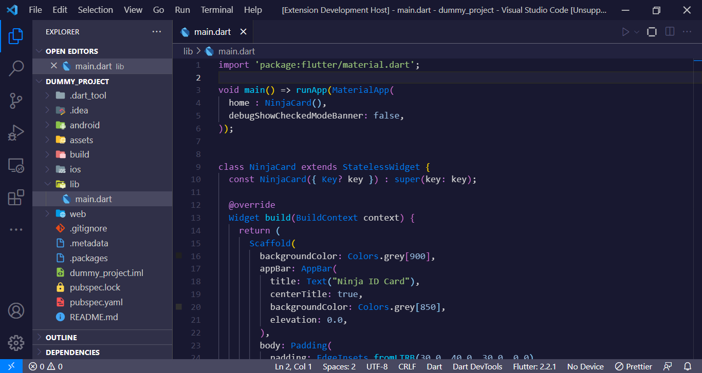

## Attack On Titan - Ymir Theme for Visual Studio Code

  

Attack On Titan: Levi is a VSCode theme for all AOT fan around the world. It is a attempt to make anime based theme available to developers. 

This VS Code themes blend seamlessly with your Modern Desktop to provide a more integrated experience.

Help us to make it better.
[Theme Repository](https://github.com/spellsaif/attack-on-titan-ymir-theme)